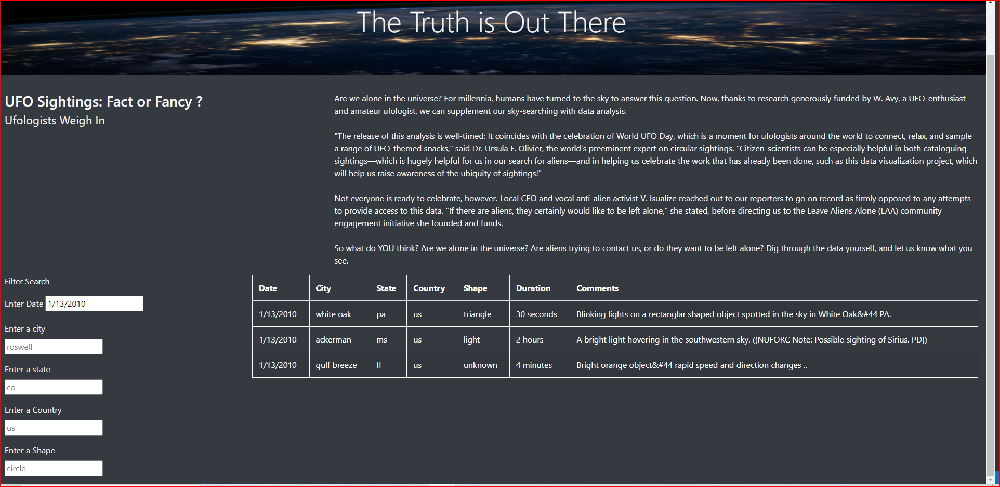
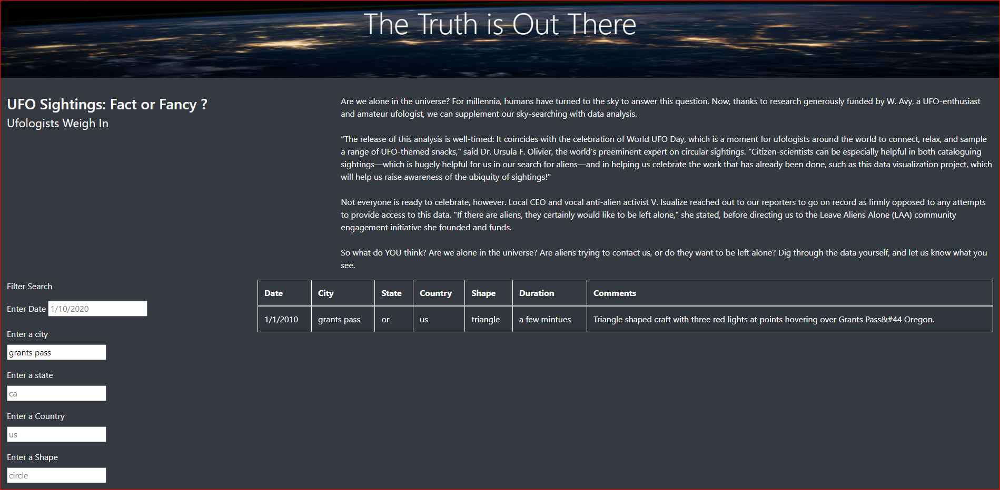
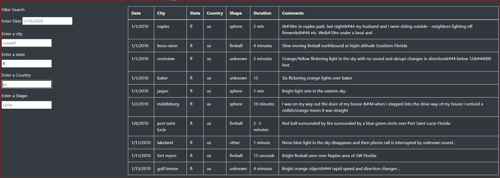
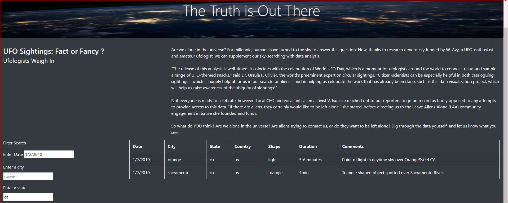
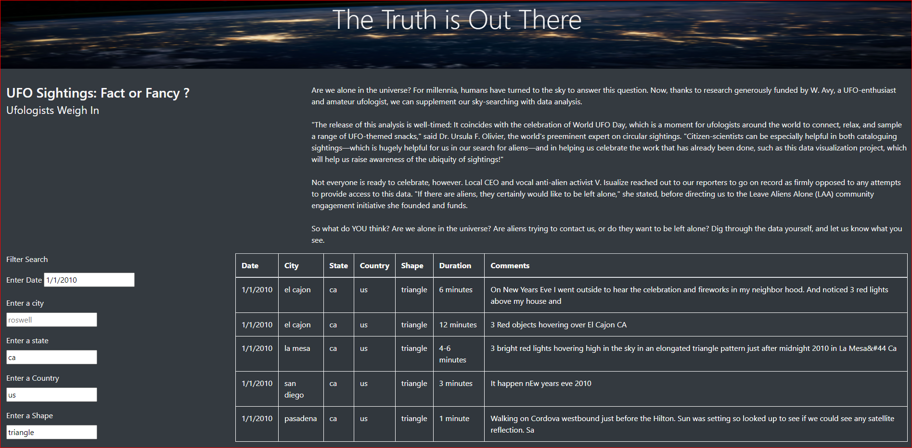

# UFO Sightings: Fact or Fancy
## Overview of the Project:
Create webpage with UFO sighting information & created table from the given data. The tabular data can be filtered by user input & the filtered table is updated in the website real time. The website can be filtered by date, city, state, country, shape. Can be filtered in any combinations

## Results:
* The placeholder shows what should be the format for each filteration. 
* The user can enter the date in the date field ( m/d/yyyy). The website will update as shown below:

* The user can enter the city name in the city filed. The updated website is shown below:

* If the user just enters the state, the output will be as below.

* The user can do combination of all or couple of them. With date & state entered, the website will dynamically change as below:

* Changes to website when date,country & shape was entered:

## Summary :
The filteration on date, city, state, country & shape can be done for only one value. 

### Recommendations:
* Drop down menu with multiple check boxes instead of single input for the filter field. 

* Change the placeholder background color after the user has eneterd a value.

